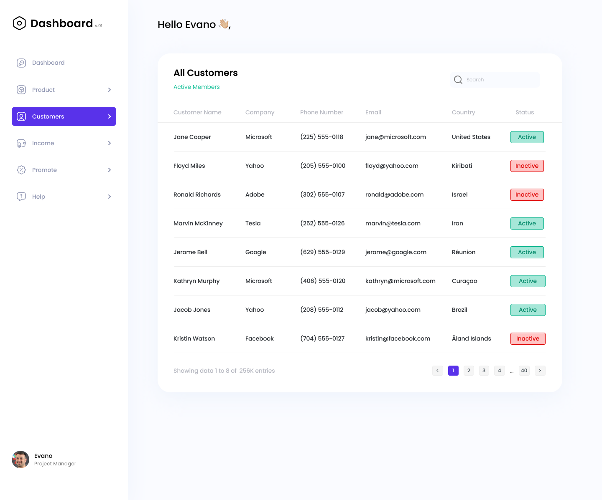

# Dashboard

## Links
<b>Website: </b><a href="https://dashboard-bohdan-134.vercel.app/">Dashboard</a>

## Preprocessor's
- pug
- scss

## Libraries
-

## Task manager
- gulp

## Database
- firebase

## Description
I created dashbpard using firebase database. It has a responsive design that allows it to display correctly on various devices. I also added CSS animations to give the project some extra aesthetics and interactivity.

For ease of development, I used the Pug and SCSS preprocessors. These tools have allowed me to write more efficient and cleaner code, as well as use powerful features like mixins and variables.

To automate the project build process, I chose Gulp, a popular tool that allows you to optimize and merge files, run code processing tasks, and much more. This greatly simplified my work and made the development process more efficient.

As a result, thanks to the use of the Firebase database, responsive design, CSS animations, Pug and SCSS preprocessors, and the Gulp builder, I created a dashbpard project that is not only functional, but also has an attractive appearance.